# Monitor Normativo

Dashboard en Streamlit que analiza logs técnicos de reportes CRC y los convierte en explicaciones claras para equipos legales y de cumplimiento.

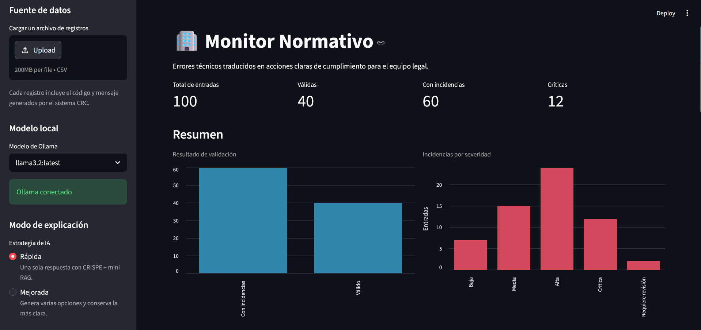

## Qué resuelve

| Problema | Solución |
|---|---|
| Los reportes CRC fallan por datos inconsistentes. | El sistema clasifica cada incidencia por severidad y tipo. |
| Legal no entiende mensajes técnicos como `Violación de unicidad`. | Ollama genera una explicación simple con impacto y acción recomendada. |
| Revisar logs manualmente toma tiempo. | El dashboard resume, filtra, prioriza y exporta resultados. |

## Stack y Arquitectura

| Componente | Uso |
|---|---|
| Python | Procesamiento, reglas, mini RAG documental y conexión con Ollama. |
| Streamlit | Interfaz, filtros, gráficas y selección de incidencias. |
| Ollama | Ejecución local del modelo Llama 3.2. |

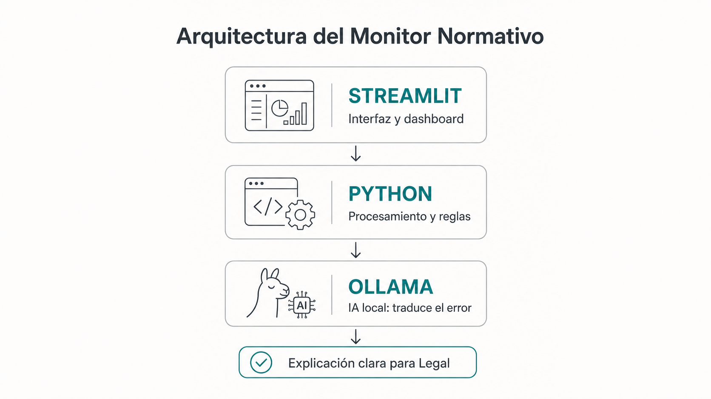

## Flujo del sistema

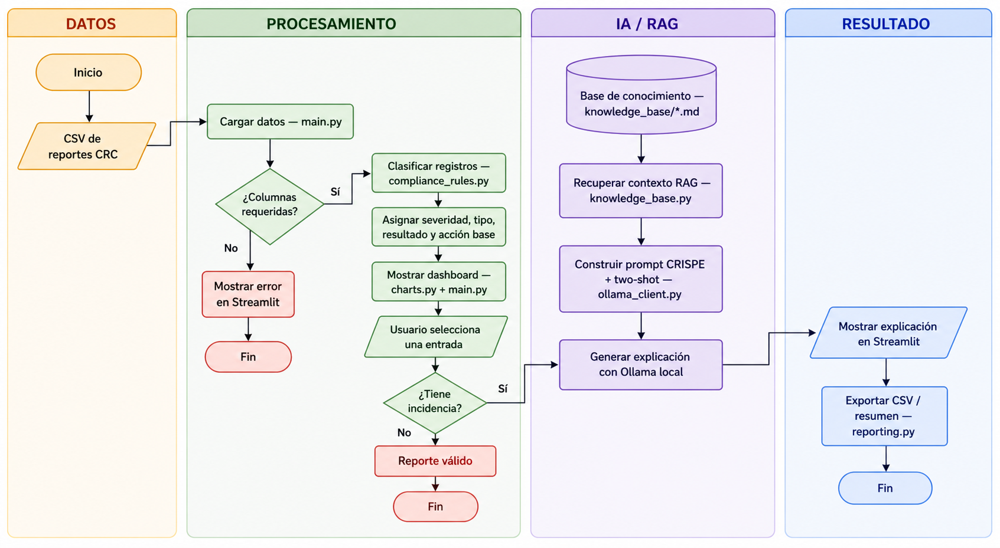

| Paso | Archivo | Resultado |
|---:|---|---|
| 1 | `generate_dataset.py` | Genera 100 registros CRC sintéticos. |
| 2 | `main.py` | Carga el CSV generado o uno subido por el usuario. |
| 3 | `src/monitor_normativo/compliance_rules.py` | Asigna severidad, tipo de incidencia y acción base. |
| 4 | `src/monitor_normativo/knowledge_base.py` + `knowledge_base/*.md` | Recupera documentos internos relevantes mediante mini RAG. |
| 5 | `src/monitor_normativo/ollama_client.py` | Envía el prompt a Ollama y recibe la explicación. |
| 6 | `src/monitor_normativo/reporting.py` | Exporta CSV analizado y resumen ejecutivo. |

## Interfaz

| Vista | Captura |
|---|---|
| Modelo local | 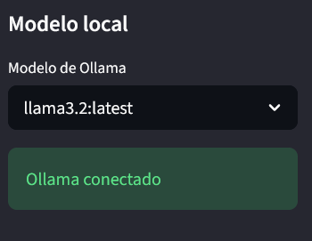 |
| Modo de explicación | 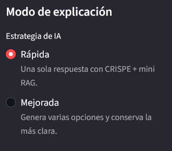 |
| Tabla de registros | 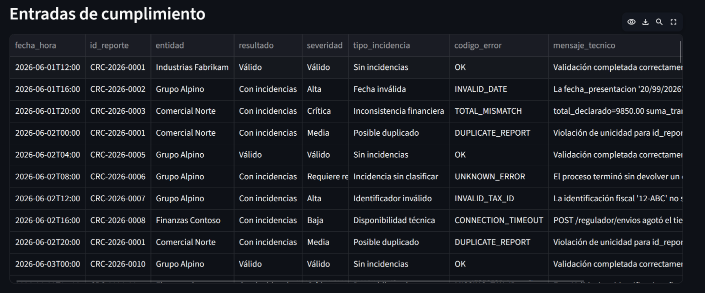 |
| Casos prioritarios | 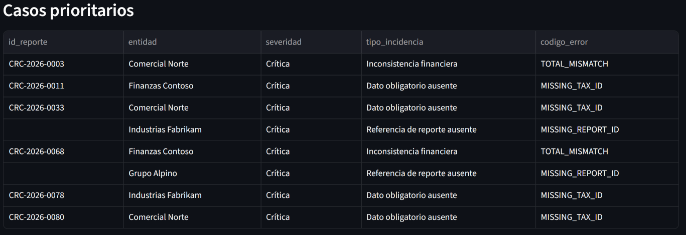 |
| Incidencias frecuentes | 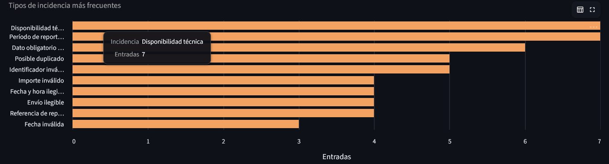 |
| Inspector de entrada | 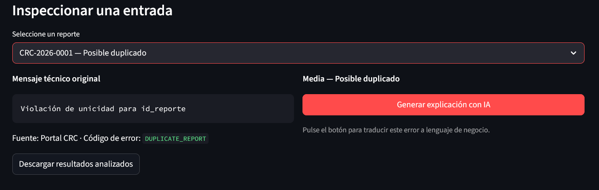 |
| Contexto RAG recuperado | 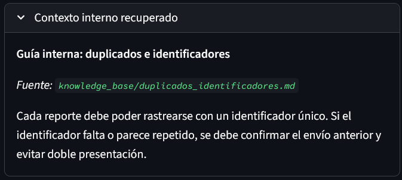 |
| Explicación generada | 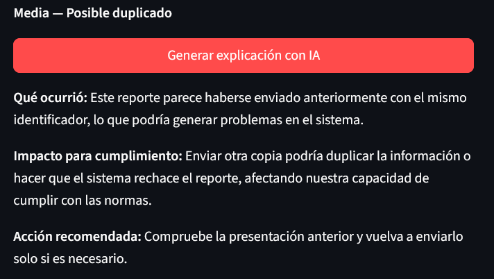 |
| Exportación | 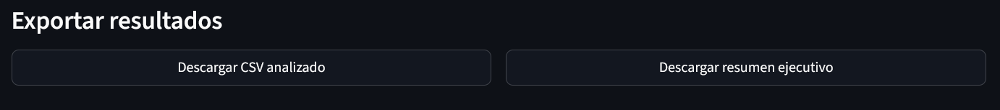 |
| Resumen Markdown | 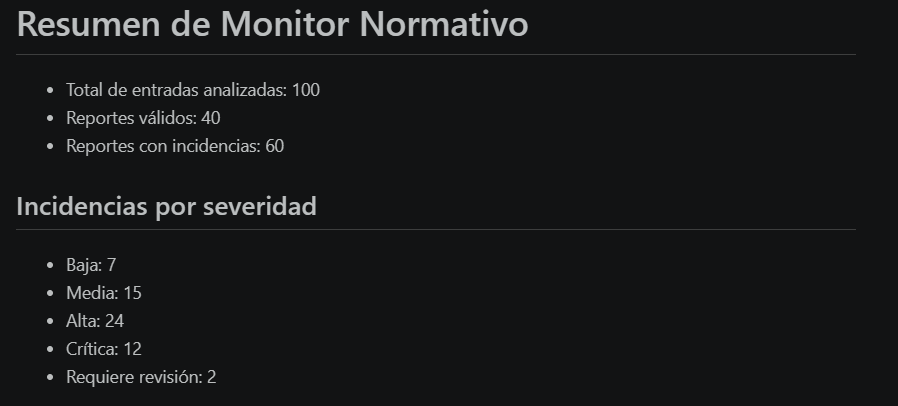 |

## Técnicas de IA

| Técnica | Uso en el proyecto |
|---|---|
| CRISPE | Estructura el prompt con contexto, rol, intención, pasos, presentación y evaluación. |
| Two-shot prompting | Incluye dos ejemplos para guiar tono, formato y nivel de detalle. |
| Mini RAG | Puntúa documentos `.md` por coincidencias y agrega el contexto más relevante al prompt. |
| Self-consistency ligera | En modo mejorado, genera varias alternativas y muestra la más clara. |

## Priorización

Debajo de la tabla principal, el dashboard muestra los casos más urgentes según severidad:

```text
Crítica → Alta → Media → Baja → Requiere revisión
```

El contexto recuperado por RAG también muestra el archivo fuente consultado.

## Datos sintéticos

`generate_dataset.py` crea un dataset reproducible en `data/synthetic_compliance_logs.csv`.

| Tipo de registro | Cantidad |
|---|---:|
| Reportes válidos | 40 |
| Errores técnicos clasificados | 58 |
| Errores desconocidos | 2 |
| Total | 100 |

Columnas esperadas:

```text
fecha_hora, id_reporte, entidad, fuente, codigo_error, mensaje_tecnico
```

## Ejecutar

```powershell
python -m pip install -r requirements.txt
python generate_dataset.py
streamlit run main.py
```

## Ollama

La app usa modelos locales de Ollama. El usuario puede elegir cualquier modelo descargado; si no tiene ninguno, puede descargar `llama3.2:latest` desde la interfaz.

```powershell
ollama pull llama3.2
ollama serve
```

## Estructura

```text
main.py                                  Entrada de Streamlit
generate_dataset.py                      Generación de datos sintéticos
data/                                    Dataset CSV de ejemplo
assets/readme/                           Capturas usadas en este README
knowledge_base/*.md                      Documentos internos consultados por el RAG
src/monitor_normativo/__init__.py        Paquete de la aplicación
src/monitor_normativo/charts.py          Métricas y gráficas
src/monitor_normativo/compliance_rules.py Reglas de clasificación
src/monitor_normativo/config.py          Configuración base
src/monitor_normativo/knowledge_base.py  Recuperación de contexto interno
src/monitor_normativo/ollama_client.py   Prompt y conexión con Ollama
src/monitor_normativo/reporting.py       Exportación de reportes
```
